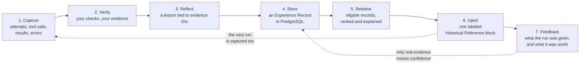

# AgentExperience.NET

[](https://github.com/fabbrik/AgentExperience.NET/actions/workflows/ci.yml)
[)](https://www.nuget.org/packages/AgentExperience.Core)
[](./LICENSE)

**Evidence-backed experience memory for .NET agents.** A preview; not production ready.

AgentExperience.NET records what an AI agent actually tried, checks whether it worked using evidence you supply
(test results, exit codes, human approvals — never the model's own claim), and stores the result as a lesson a later
run can reuse. Before the next run, it finds the lessons that apply and hands them to the agent as clearly labeled
reference material. It plugs into [Microsoft Agent Framework](https://github.com/microsoft/agent-framework) (MAF) and
stores everything in PostgreSQL, without replacing either.

## Why

Conversation history and fact memory do not answer the questions that matter when an agent retries similar work:

- Which approaches failed, and which succeeded?
- How was success *verified*, not just claimed?
- In which environment does the lesson apply?
- Is it safe for another agent, or another team, to reuse?

This library keeps observable evidence (tool calls, results, errors, verification checks) and never stores hidden
chain-of-thought. Every lesson points at the evidence it rests on, has an audited lifecycle, and can be revoked,
shared under an expiring grant, or erased.

## How it works

Each run feeds the next one. The loop has seven steps:



1. **Capture.** `UseExperienceCapture` wraps a MAF agent and records every invocation as an *Experience Run*.
   Content is sanitized before it is kept; unsafe content is refused, not stored.
2. **Verify.** Your own required checks, over evidence from a verification round you closed. No model is involved.
3. **Reflect.** A lesson with reuse guidance, preconditions and warnings, traceable to the evidence it came from.
4. **Store.** A verified run becomes a reusable *Experience Record*; a failed one is kept but quarantined.
5. **Retrieve.** Text search, plus optional vector search, filtered for eligibility before anything is ranked.
6. **Inject.** The surviving lessons go into the agent's context as one *Historical Reference* message, labeled as
   untrusted reference material. Your tool-approval boundary, not the label, is what stops a harmful action.
7. **Feedback.** You record which lessons a run was given. That alone moves nothing: a lesson's confidence changes
   only on evidence about a run the library actually delivered it into — your own verified checks, a human
   assessment carrying a token your review flow minted, or a comparative evaluation with its own evidence.

The terms are defined in the [glossary](docs/guide/README.md#glossary).

## Install

Five packages, all published on nuget.org as `0.1.0-preview.2`. Each targets `net8.0`, `net9.0` and `net10.0`.

| Package | What it is for |
| --- | --- |
| [`AgentExperience.Abstractions`](src/AgentExperience.Abstractions/README.md) | The domain types and ports (runs, evidence, records, scope, stores). BCL only. Reference it directly only to implement a port yourself |
| [`AgentExperience.Core`](src/AgentExperience.Core/README.md) | The engine: sanitization, capture, verification, reflection, finalization, lifecycle, confidence, retrieval, reuse feedback |
| [`AgentExperience.MicrosoftAgentFramework`](src/AgentExperience.MicrosoftAgentFramework/README.md) | The MAF adapter: capture of agent runs and tool calls, and Historical Reference injection. Needs `Microsoft.Agents.AI` `[1.22.0, 2.0.0)` |
| [`AgentExperience.Storage.Postgres`](src/AgentExperience.Storage.Postgres/README.md) | PostgreSQL storage: records, lifecycle, text search, sharing grants, reuse feedback, deletion, crypto-shredding, and the schema migrator. PostgreSQL 15–18 |
| [`AgentExperience.Storage.Postgres.Vectors`](src/AgentExperience.Storage.Postgres.Vectors/README.md) | Optional. pgvector embeddings for search by meaning, over any `Microsoft.Extensions.AI` embedding generator |

```bash
dotnet add package AgentExperience.MicrosoftAgentFramework --prerelease
dotnet add package AgentExperience.Storage.Postgres --prerelease
# optional: semantic search
dotnet add package AgentExperience.Storage.Postgres.Vectors --prerelease
```

The MAF adapter brings in Core and Abstractions.

## Quick start

This wires steps 1 to 6 for one MAF agent: apply the schema, register the services, inject past lessons before each
run, and capture, verify and store each run after it (step 7 is in [Reuse feedback](docs/guide/reuse-feedback.md)).
It compiles against `0.1.0-preview.2`. Before you run it, create the two database roles it names (a few lines of SQL,
in [Deployment](docs/guide/deployment.md#creating-the-roles)); for a throwaway local database with a single role,
skip the `ApplyApplicationRolePrivilegesAsync` call, which refuses the role running it. You supply four things:
`chatClient` (any `Microsoft.Extensions.AI` `IChatClient`), two connection strings, and `EvidenceFor`, which turns
your own checks (for example, a test run) into `Evidence` for the round you closed.

```csharp
using AgentExperience.Abstractions;
using AgentExperience.Core.Capture;
using AgentExperience.Core.DependencyInjection;
using AgentExperience.Core.Finalization;
using AgentExperience.Core.Retrieval;
using AgentExperience.Core.Sanitization;
using AgentExperience.Core.Verification;
using AgentExperience.MicrosoftAgentFramework;
using AgentExperience.MicrosoftAgentFramework.Injection;
using AgentExperience.Storage.Postgres;
using AgentExperience.Storage.Postgres.DependencyInjection;
using Microsoft.Agents.AI;
using Microsoft.Extensions.AI;
using Microsoft.Extensions.DependencyInjection;
using Npgsql;

// 1. Apply the schema, on every deploy, as the database owner role.
await using (var owner = NpgsqlDataSource.Create(ownerConnectionString))
{
    await ExperienceSchemaMigrator.MigrateAsync(owner, CancellationToken.None);
    await ExperienceSchemaMigrator.ApplyApplicationRolePrivilegesAsync(
        owner, new ExperienceApplicationRoleOptions("agent_experience_app"), CancellationToken.None);
}

// 2. Register the services. The stores connect as the application role.
var toolPolicy = new SanitizationPolicy(
    AllowedFieldNames: new HashSet<string> { "ticketId", "strategy" },   // kept
    SecretFieldNames: new HashSet<string> { "apiKey" },                  // redacted
    MaxDepth: 4, MaxFieldCount: 50, MaxValueLength: 4_000, MaxFieldNameLength: 100);

var services = new ServiceCollection();
services.AddSingleton(NpgsqlDataSource.Create(appConnectionString));
services.AddAgentExperiencePostgresStore();
services.AddAgentExperiencePostgresCandidateSource();
services.AddAgentExperienceCore(
    new SanitizationOptions(new Dictionary<string, SanitizationPolicy>
    {
        ["ToolArguments"] = toolPolicy,
        ["ToolResult"] = toolPolicy,
    }),
    new CaptureLimits(MaxAttemptsPerRun: 10, MaxToolCallsPerAttempt: 50, MaxResultLength: 4_000, MaxErrorLength: 4_000));
services.AddAgentExperienceRetrieval();
await using var provider = services.BuildServiceProvider();

// 3. Scope and authority come from your own authentication, never from model output.
var scope = new Scope(TenantId: "contoso", ApplicationId: "support", ProjectId: "tickets");
var authorization = new AuthorizationContext(
    TenantId: "contoso", PrincipalId: "svc-support-agent", Roles: [], IssuedAt: DateTimeOffset.UtcNow);

// 4. Before each run: retrieve applicable lessons and inject them as a labeled Historical Reference.
var injection = new ExperienceContextProvider(
    provider.GetRequiredService<ExperienceRetrievalService>(),
    provider.GetRequiredService<IExperienceRecordStore>(),
    new ExperienceInjectionOptions
    {
        ResolveRequest = _ => new RetrieveExperienceRequest(authorization, scope, TaskText: "triage a stuck refund"),
    });

// 5. After each run: capture what happened, verify it with your checks, and store the lesson.
AIAgent agent = new ChatClientAgent(chatClient, new ChatClientAgentOptions { AIContextProviders = [injection] })
    .AsBuilder()
    .UseExperienceCapture(provider.GetRequiredService<IExperienceCaptureService>(), new ExperienceCaptureOptions
    {
        ResolveRun = _ => new ExperienceRunDescriptor(TaskId: "triage-ticket", Scope: scope),
        FinalizationService = provider.GetRequiredService<ExperienceFinalizationService>(),
        ResolveFinalization = context =>
        {
            var round = new ClosedVerificationRound(Guid.NewGuid(), ArtifactRevision: "build-42");
            return new FinalizeExperienceRequest(
                RunId: context.Run.RunId,
                Authorization: authorization,
                ClosedRound: round,
                RequiredChecks: [new RequiredCheck("tests-pass", ExpectedKind: "TestResult")],
                Evidence: EvidenceFor(context.Run, round),   // your own checks, never the model's word
                CurrentArtifactRevision: "build-42",
                StorageDecision: StorageDecision.Permit,
                FinalizedAt: DateTimeOffset.UtcNow);
        },
        OnCaptureFailure = failure => Console.Error.WriteLine($"capture failed at {failure.Stage}"),
    })
    .Build();

var response = await agent.RunAsync("Ticket #4812: a refund is stuck on a lock. Triage it.");
```

What happens: the first run finds nothing to inject and runs normally. After it, if your `tests-pass` evidence
passed, its lesson is stored as `Validated`; if not, it is stored as `Quarantined` and never reused. The next run on a
similar task can get that lesson in its context, if its task text matches and the lesson clears the confidence
floor (0.5; a new validated lesson starts at 2/3). In a real host, derive `TaskText` from the invocation's messages
rather than a constant (see [Injection](docs/guide/injection.md#wiring-it)). Nothing here throws into the agent: capture and injection failures are
reported through callbacks, and a slow or unavailable database means no memory for that run, not a failed run.

For a runnable version with no database and no
credentials, see [the sample](#run-the-sample).

## Status: a preview, not production ready

`0.1.0-preview.2` is a preview. It claims no production readiness, and public APIs may change between previews (each
change is a reviewed diff against a checked-in baseline). Use it to evaluate the approach, not to hold data you
cannot afford to lose.

- **Known limits** — problems a code change could fix, which keep the version a preview: **none currently**. The
  version still stays a preview until the maintainers' deferred-work ledger is closed as well.
- **Documented boundaries** — what no code change can remove, stated exactly (each keeps the `KL-` number it had as a
  known limit):
  - **KL-2:** erasure cannot reach copies of the derived search data, and without opt-in crypto-shredding it reaches
    only the live rows, not backups, replicas or WAL.
  - **KL-11:** confidence evidence proves a run was *given* a lesson, not that it *used* it, and the library trusts
    the host's own bookkeeping and key custody.
  - **KL-12:** a withdrawn lesson stays in a reused chat session's history; the withdrawal notice is advisory.

  Read [Known limits and documented boundaries](docs/known-limits.md) for the exact statement of each, and
  [Limits history](docs/limits-history.md) for what earlier previews fixed.
- **Supported:** .NET 8, 9 and 10; PostgreSQL 15 to 18 (not 14); `Microsoft.Agents.AI` 1.22.0 and any later 1.x.
  .NET 8 and 9 leave support on 10 November 2026; the first preview published after that date drops `net8.0` and
  `net9.0`. See [Compatibility evidence](docs/compatibility-evidence.md).
- **Evidence of benefit:** the end-to-end sample and the reuse baseline use deterministic fixtures and scripted models,
  so they show the loop works, not that it helps a real model. A live-model experiment (Gemini, then Azure OpenAI) is
  in progress and has no results yet.

## Documentation

| Start here | |
| --- | --- |
| [Guide overview and glossary](docs/guide/README.md) | Every page, and the terms used throughout |
| [Known limits and documented boundaries](docs/known-limits.md) | What this preview does not do, stated exactly |
| [The end-to-end sample](samples/AgentExperience.Sample.EndToEnd/README.md) | One command, no credentials |

| The learning loop | |
| --- | --- |
| [Capturing runs with MAF](docs/guide/capture.md) | Options, retries as attempts of one run, supported agent types |
| [Finalization](docs/guide/finalization.md) | Verification, reflection, and storing a record |
| [Lifecycle](docs/guide/lifecycle.md) | Statuses, supersession, the append-only audit trail |
| [Confidence and independence](docs/guide/confidence.md) | How evidence moves a score, and what is verified |
| [Reuse feedback](docs/guide/reuse-feedback.md) | Recording what a run was given, and what it was worth |
| [Indexing](docs/guide/indexing.md) | Embeddings for search by meaning |
| [Retrieval](docs/guide/retrieval.md) | Eligibility, ranking, the hybrid channel, timeouts |
| [Injection into MAF](docs/guide/injection.md) | The Historical Reference block, limits, reused sessions |

| Operating it | |
| --- | --- |
| [Deployment](docs/guide/deployment.md) | Wiring, the two database roles, the trust boundary |
| [Sharing and grants](docs/guide/sharing.md) | Letting another scope read one record, with an audit trail |
| [Deletion and retention](docs/guide/deletion-and-retention.md) | Erasure, tombstones, retention sweeps |
| [Crypto-shredding](docs/guide/crypto-shredding.md) | Erasure that reaches backups, replicas and WAL |
| [PostgreSQL schema](docs/guide/postgres-schema.md) | Every migration, `0001` to `0018` |
| [Telemetry contract](docs/telemetry.md) | Every span, metric and attribute |
| [Security suite](docs/security-suite.md) | The tests behind the security claims: tenant isolation, sanitization, revoked records, untrusted context |
| [Compatibility evidence](docs/compatibility-evidence.md) | Supported versions and the evidence for each pin |
| [Changelog](CHANGELOG.md) · [Releasing](RELEASING.md) · [Security policy](SECURITY.md) | |

[`docs/AgentExperience_NET_MAF_Production_Architecture.md`](docs/AgentExperience_NET_MAF_Production_Architecture.md)
is the original research that started the project. It is kept for history and does not describe the current code.

## Build and test

Requires the [.NET SDK 10.0.302](https://dotnet.microsoft.com/) or a later feature band (see `global.json`), plus
the .NET 8 and .NET 9 runtimes, because every test project that exercises the packages runs on all three target
frameworks. `dotnet test --framework net10.0` runs only the `net10.0` part.

```bash
dotnet restore
dotnet build
dotnet test
```

No test needs model credentials or a network: every model and embedding in the suite is a deterministic fake. The
storage tests start PostgreSQL containers through Testcontainers, so they need Docker; they run against PostgreSQL 16
unless `AGENTEXPERIENCE_POSTGRES_MAJOR` names 15, 17 or 18. [CONTRIBUTING.md](CONTRIBUTING.md) has the filter that
skips them, the crypto-shredding test mode, and how to accept a deliberate public API change. How a release is
verified and published (from a pushed version tag, after a maintainer approves it, through NuGet Trusted Publishing)
is in [RELEASING.md](RELEASING.md).

### Run the sample

```bash
dotnet run --project samples/AgentExperience.Sample.EndToEnd
```

Seven stages, exit code 0, on a fresh clone: no Docker, no PostgreSQL, no model credentials, no network. Run it twice
and the two transcripts are byte-identical. Set `AGENTEXPERIENCE_SAMPLE_POSTGRES` to a connection string to run the
same seven stages against the real PostgreSQL adapters. The sample shows that the loop runs end to end; it does not
measure whether reuse helps a real model. See [its README](samples/AgentExperience.Sample.EndToEnd/README.md) for
what it proves and what it deliberately does not.

## Contributing

Issues and pull requests are welcome. See [CONTRIBUTING.md](CONTRIBUTING.md) and the
[Code of Conduct](CODE_OF_CONDUCT.md). To report a vulnerability, follow [SECURITY.md](SECURITY.md).

Development is spec-driven with the [BMAD Method](https://github.com/bmad-code-org/BMAD-METHOD) and AI-assisted
implementation. The planning trail (product brief, PRD, architecture, epics and specs) is versioned in
[`_sdlc/`](_sdlc/), and each change is reviewed by independent adversarial, edge-case and verification-gap passes
before it is committed.

## License

[Apache-2.0](./LICENSE)
