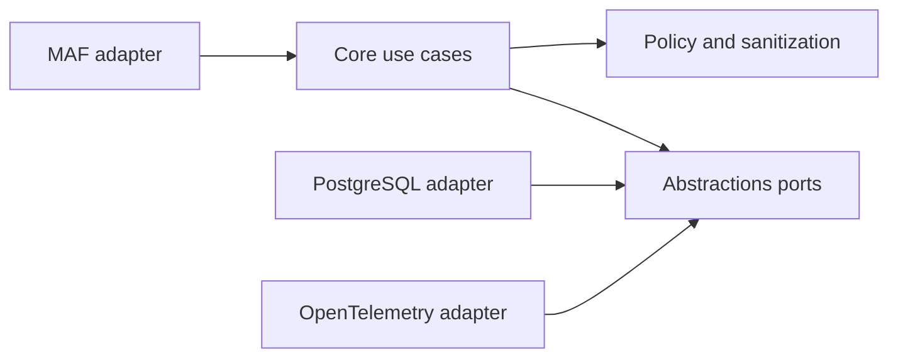

# Architecture Spine — AgentExperience.NET MVP

## Design Paradigm

Hexagonal architecture separates portable experience contracts and policies from adapters for MAF, storage, models, and telemetry. Experience lifecycle changes are represented as append-only events plus a queryable current projection.



## Invariants & Rules

### AD-1 — Portable core boundary

- **Binds:** all capabilities
- **Prevents:** MAF or storage types leaking into reusable domain code
- **Rule:** `AgentExperience.Abstractions` and `AgentExperience.Core` may depend only on .NET BCL and explicitly approved neutral abstractions; all MAF, database, model, and telemetry dependencies live in adapter packages.

### AD-2 — Evidence before trust

- **Binds:** CAP-1, CAP-2, CAP-3, CAP-6
- **Prevents:** an unverified anecdote becoming trusted guidance
- **Rule:** persistence and retrieval retain outcome evidence, provenance, scope, confidence, and lifecycle status; retrieved experience is always labeled Historical Reference.

### AD-3 — Failure-preserving capture

- **Binds:** CAP-1, CAP-5
- **Prevents:** failed runs disappearing because post-invocation success callbacks are skipped
- **Rule:** the MAF integration must capture failed invocations through an outer lifecycle path or equivalent middleware and must never use success-only persistence as its sole capture mechanism.

### AD-4 — Policy before persistence and context

- **Binds:** CAP-1, CAP-4, CAP-5, CAP-6
- **Prevents:** secrets, unauthorized records, or unsafe content entering storage or agent context
- **Rule:** sanitization and policy decisions execute before persistence and before context injection; policy denial is fail-closed for retrieval and storage.

### AD-5 — Scope is explicit

- **Binds:** CAP-4, CAP-6
- **Prevents:** cross-tenant or accidental global experience transfer
- **Rule:** every operation requires host-established authorization and explicit request scope; request scope selects only within that authority. Strict mode never infers global scope, and predicates are applied inside the persistence query boundary. Sharing grants permit read/retrieval/injection only, within the same tenant/application/project; mutation requires separate authority.

### AD-6 — One lifecycle owner

- **Binds:** CAP-2, CAP-3, CAP-6
- **Prevents:** conflicting confidence/status mutations by independent components
- **Rule:** Core owns finalization: evaluate the sanitized snapshot, reflect, enforce policy, create the record and initial event, and atomically persist event/projection with expected revisions and idempotent IDs. Adapters never invent transitions or scores. Failed stages return explicit host-visible results; database failure cannot be reported as durable success.

### AD-7 — Bounded optional retrieval

- **Binds:** CAP-4, CAP-5, CAP-7
- **Prevents:** memory outages blocking execution or turning stale context into authority
- **Rule:** retrieval has a caller-configured timeout and safe empty-result behavior; retrieval failures are observable and never bypass policy or approvals.

### AD-8 — Verification rounds and distinct confidence

- **Binds:** CAP-2, CAP-3, CAP-6
- **Prevents:** earlier failed attempts blocking a repaired result or completion scores masquerading as reuse confidence
- **Rule:** evaluate required checks only in the host-closed final round for the current artifact revision. Same-round Fail dominates; missing/current-round errors yield Unknown. Preserve earlier rounds as history. Completion score is the fraction of required checks passing; reuse confidence is (1+S)/(2+S+F), where independent accepted supporting validations S include initial validation once and F counts contradictions. Deduplicate evidence; status gates override numeric scores.

### AD-9 — Derived embedding ownership

- **Binds:** CAP-4
- **Prevents:** stale embeddings, orphan vector indexes, and provider outages blocking canonical persistence
- **Rule:** indexing generates vectors from sanitized summaries after record commit, stores model/dimension/content hash/revision, and conditionally writes only to the matching live revision. Scoped explicit reindexing is idempotent; text retrieval remains available when embeddings are absent or incompatible.

### AD-10 — Erasure is an explicit audit exception

- **Binds:** CAP-4, CAP-6
- **Prevents:** revocation being mistaken for deletion and delayed writers recreating deleted data
- **Rule:** authorized expected-revision deletion atomically removes live canonical/event payloads, vectors, grants, and dependent feedback, retaining only an opaque-ID/scope/timestamp tombstone. Normal events are append-only; erasure is an explicit exception. Default retention is indefinite; optional CreatedAt-based bounded sweeps are host-invoked. Backups and external artifacts remain host responsibilities.

### AD-11 — Bounded telemetry dimensions

- **Binds:** CAP-7
- **Prevents:** conflicting correlation and metric-cardinality conventions
- **Rule:** traces may carry safe run/record IDs; metric labels are bounded operation/outcome dimensions. Exporter failure never blocks agent execution.

### AD-12 — Reuse upstream infrastructure at adapter boundaries

- **Binds:** all capabilities and adapter packages
- **Prevents:** competing runtime, retrieval, evaluation, redaction, and telemetry frameworks
- **Rule:** follow reuse-boundaries.md. MAF owns invocation/tools/sessions/context plumbing; ecosystem APIs supply embeddings, vector/database access, redaction, and applicable evaluation/reporting. Host services own identity and exporters. Custom code owns experience mapping, verification, lifecycle, applicability, and transactional record semantics. Story 1.7 supplies executable fit evidence before dependent adapters; unsupported generic features are deferred rather than silently rebuilt.

## Consistency Conventions

| Concern | Convention |
| --- | --- |
| Naming | PascalCase public C# types; `I`-prefixed ports; `Experience*` domain terms; stable `CAP-N`, `AD-N`, `FR-N`, and `SM-N` identifiers. |
| Data | `Guid` identifiers, `DateTimeOffset` timestamps, immutable records, JSON serialization with explicit versioning, UTC persistence. |
| State | Commands flow through Core; lifecycle events are append-only; current state is a projection; cancellation tokens are required on I/O ports. |
| Errors | Typed policy/evaluation outcomes for expected decisions; exceptions for infrastructure failures; never log secrets or private reasoning. |
| Configuration | Options are validated at startup; tenant scope and sanitization are required in production mode. |

## Stack

| Name | Version |
| --- | --- |
| C# / .NET | 10.0; abstractions target .NET 8+ compatibility where feasible |
| Microsoft Agent Framework | version pinned by the first compatibility-tested adapter release |
| PostgreSQL | 16+ |
| pgvector | 0.7+ |
| OpenTelemetry .NET | 1.10+ |

## Structural Seed

```text
src/
  AgentExperience.Abstractions/        # domain contracts and ports
  AgentExperience.Core/                # use cases and lifecycle rules
  AgentExperience.MicrosoftAgentFramework/ # MAF adapter
  AgentExperience.Storage.Postgres/   # persistence and retrieval adapter
  AgentExperience.OpenTelemetry/       # telemetry adapter
tests/
  AgentExperience.Core.Tests/
  AgentExperience.Storage.Postgres.Tests/
  AgentExperience.MicrosoftAgentFramework.Tests/
samples/
  AgentExperience.MafDemo/
```

## Capability → Architecture Map

| Capability / Area | Lives in | Governed by |
| --- | --- | --- |
| CAP-1 capture | MAF adapter + Core capture | AD-1, AD-3, AD-4 |
| CAP-2 evaluation | Core evaluator pipeline | AD-1, AD-6, AD-8 |
| CAP-3 reflection | Core reflector port and implementation | AD-1, AD-2 |
| CAP-4 persistence/retrieval | Store ports + PostgreSQL adapter | AD-2, AD-5, AD-7, AD-9, AD-10 |
| CAP-5 MAF injection | MAF context provider | AD-2, AD-3, AD-4, AD-7 |
| CAP-6 governance/reuse | Core lifecycle and policy | AD-2, AD-4, AD-5, AD-6, AD-8, AD-10 |
| CAP-7 observability | OpenTelemetry adapter | AD-1, AD-7, AD-11 |

## Deferred

- Exact MAF package version: bind when the first adapter compatibility test is implemented.
- SQL schema and index details: owned by the PostgreSQL adapter and migrations.
- Neo4j, AgentMemory.NET, Mem0Sharp, MCP, CLI, background consolidation, procedural promotion, and model-based judging: deferred until MVP adoption evidence exists.
- Deployment topology and managed PostgreSQL provider: deferred because the MVP must remain self-hostable and provider-neutral.
