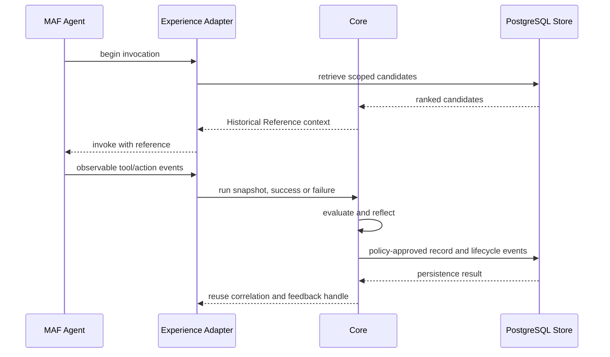

# AgentExperience.NET MVP Solution Design

## Context

AgentExperience.NET sits between Microsoft Agent Framework execution and durable memory/storage. MAF remains responsible for agents, tools, workflows, sessions, approvals, and checkpoints. AgentExperience.NET owns the experience lifecycle: capture, evaluation, reflection, confidence, applicability, transfer, revocation, and reuse feedback.

## Runtime flow

## Component responsibilities

These are ownership boundaries, not requirements to implement every mechanism ourselves. The binding [reuse contract](../../../specs/spec-agentexperience-net/reuse-boundaries.md) selects MAF lifecycle and context hooks, existing embedding/database interfaces, evaluation/redaction adapters, and host-owned telemetry. Story 1.7 verifies integration fit before production adapter development.

- **Abstractions:** immutable domain records, store/retriever/evaluator/reflector/policy/sanitizer ports, and event contracts.
- **Core:** capture orchestration, evaluator composition, reflection, confidence, environment scoring, lifecycle transitions, and policy coordination.
- **MAF adapter:** pre-invocation retrieval/context injection, middleware event capture, session correlation, and failure-preserving post-invocation finalization.
- **PostgreSQL adapter:** canonical record projection, append-only lifecycle events, vector/text candidate search, scope predicates, and migrations.
- **OpenTelemetry adapter:** spans and metrics with run and experience identifiers; redaction remains enforced.

## Data ownership

Core owns the semantic meaning and legal transitions of an Experience Record. PostgreSQL owns durable storage and query projections. The MAF adapter owns runtime correlation only. No adapter may invent lifecycle transitions or widen scope.

Core finalization connects capture to evaluation, reflection, authorization/policy, and atomic initial event/projection persistence. Stage failures remain observable; host retries use stable identifiers. Verification considers the host-closed final round for the current artifact revision, preserving earlier failed rounds as history. Task completion score is distinct from the versioned reuse-confidence heuristic in AD-8.

Host-established authority limits requested scope. Sharing grants permit reading and injection only; they never grant mutation rights. Indexing runs after canonical commit and stores revision-checked embeddings, with explicit reindexing and text retrieval available during provider failure.

Authorized deletion removes live payloads and dependent data while retaining a minimal tombstone to reject late writes. Default retention is indefinite; optional age-based sweeps are host-scheduled. Backup and external artifact deletion is outside the live-store guarantee. Correlation IDs appear in traces; metric dimensions remain bounded.

## Security and failure behavior

Sanitization is mandatory before persistence and context injection. Retrieval is fail-closed on policy denial and fail-soft on infrastructure timeout, returning no historical context while emitting telemetry. Retrieved experience is untrusted data and is delimited/labeled accordingly. Tool approvals and MAF policy remain authoritative.

## First implementation slice

Implement the in-memory Core path first: sanitize, capture, evaluate, and reflect. Prove MAF capture next, then scoped PostgreSQL storage, atomic lifecycle persistence, and Core finalization. Add text retrieval before embedding ingestion/hybrid search and MAF injection. The epics document specifies the exact story execution order; each story includes its own tests.

## Compatibility and release policy

AgentMemory.NET already covers trace capture, memory trust/isolation, recall, and lifecycle-related features. MagiCore, reached through the former Mem0Sharp URL, offers retrieval and history infrastructure. Treat both as optional integration candidates, not evidence that generic memory features are unique to AgentExperience.NET. Their compatibility with canonical experience transactions and verification remains unproven.

MAF compatibility is isolated in its package and tested against an explicit package version in CI. Core packages follow semantic versioning; breaking public contract changes require a major version. Storage schema changes use migrations and preserve event history.
