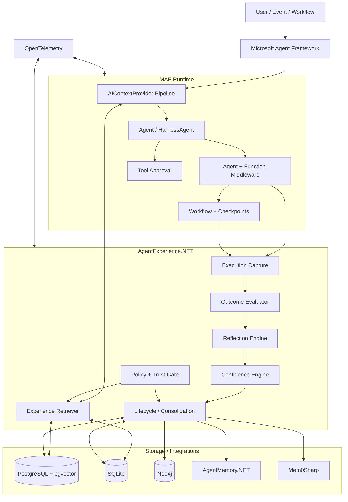

# AgentExperience.NET
## Production-Grade Experience Memory and Learning Layer for Microsoft Agent Framework

**Status:** Architecture & Open-Source Project Design Proposal  
**Version:** 0.1-draft  
**Research date:** 2026-09-05  
**Primary language:** C# / .NET 10 (with .NET 8+ compatibility considered for core abstractions)  
**License recommendation:** Apache-2.0  
**Working project name:** `AgentExperience.NET`  
**MAF integration package:** `AgentExperience.MicrosoftAgentFramework`

---

## Role + Task

**Role:** Senior .NET / Agentic AI architect and open-source project designer.  
**Task:** Research AgentMemory.NET, Mem0Sharp, CogniCore, and Microsoft Agent Framework (MAF) source-level extension points, then design a production-grade open-source C# project that adds portable experience memory, reflection, evidence-based learning, cross-agent transfer, lifecycle management, safety, and observability to MAF.

---

# 1. Executive Summary

Microsoft Agent Framework already provides the execution substrate needed for serious agents: agents, sessions, tools, context providers, middleware, workflows, checkpoints, planning/todos, harness support, approvals, and OpenTelemetry integration. What it does **not yet provide as a first-class .NET abstraction** is a portable, evidence-backed representation of **experience**:

> What task was attempted, what observable actions were tried, what failed, what succeeded, how success was verified, how confident we are, whether the experience still applies, and whether another agent should reuse it.

This gap is explicitly recognized in a Microsoft Agent Framework community proposal from August 2026 asking for “Portable Experience Memory So Agents Can Learn From Previous Work.” The proposal distinguishes conversation memory from experience memory and suggests a structured record of tasks, attempts, outcomes, evidence, confidence, tools, and environment.

The existing open-source ecosystem provides important pieces:

- **AgentMemory.NET**: strong graph-native short-term, long-term, and reasoning/tool memory for .NET, with a native MAF `AIContextProvider` integration and Neo4j persistence.
- **Mem0Sharp**: local-first .NET cognitive memory with hybrid retrieval, consolidation (“dreaming”), associations, audit history, and multiple persistence providers.
- **CogniCore**: Python-based cognitive infrastructure that demonstrates experience reuse, reflection, replay, failure prediction, cognitive memory tiers, safety, and learning-oriented feedback loops.
- **MAF itself**: exposes exactly the lifecycle hooks needed to build the missing layer, especially `AIContextProvider`, `AgentSession`, middleware, the harness, tool approval, workflow checkpointing, and observability.

The proposed project, **AgentExperience.NET**, should **not** become another general-purpose memory database or another agent framework. It should be a focused cognitive/experience layer with six responsibilities:

1. **Capture observable execution experience** from MAF runs and tool calls.
2. **Evaluate outcomes** using deterministic validators first and optional LLM judges second.
3. **Reflect into structured, user-visible lessons** without storing private chain-of-thought.
4. **Retrieve relevant prior experience** using hybrid, confidence-aware, environment-aware ranking.
5. **Consolidate and lifecycle-manage experience** through validation, supersession, decay, contradiction, and promotion.
6. **Transfer experience safely across agents** while enforcing tenant, project, capability, trust, and environment boundaries.

The architectural north star is:

```text
Goal
  │
  ▼
Plan / Execute (MAF)
  │
  ├───────────────► Retrieve relevant prior experiences
  │                         │
  │                         ▼
  │                   Context injection
  │
  ▼
Observable actions / tool calls
  │
  ▼
Outcome + evidence
  │
  ▼
Evaluation
  │
  ▼
Structured reflection
  │
  ▼
Experience candidate
  │
  ▼
Validation / confidence / policy
  │
  ▼
Persistent Experience Store
  │
  ├───────────────► future sessions
  ├───────────────► other authorized agents
  └───────────────► consolidation / deprecation / promotion
```

The project should deliberately **avoid online model-weight modification**. “Learning” here means durable experience reuse and behavior adaptation through verified external memory, not uncontrolled self-modification.

---

# 2. The Precise Gap

## 2.1 Conversation memory is not experience memory

Conversation memory answers:

- What did the user say?
- What did the assistant say?
- What preferences or facts were observed?
- What was discussed in a previous session?

Experience memory answers:

- What problem was solved?
- What approach was attempted first?
- Why did that attempt fail, based on observable evidence?
- What approach ultimately worked?
- How was the result verified?
- In what environment did it work?
- What preconditions were required?
- What should a future agent avoid repeating?
- How much trust should be placed in this lesson today?

A production system needs both.

## 2.2 The transferable unit should be structured experience, not hidden reasoning

AgentExperience.NET must **not attempt to capture or expose model private chain-of-thought**. It should store only observable and deliberately generated artifacts such as:

- user-visible task description;
- tool calls and sanitized arguments;
- tool outputs and error classes;
- code/test/deployment results;
- explicit agent action summaries;
- external evaluator results;
- human feedback;
- structured post-run reflection;
- provenance and timestamps.

A reflection record can say:

> “Increasing the timeout did not resolve the connection failures. The failure stopped after the connection lifetime bug was corrected and integration tests passed.”

It does not need to preserve internal hidden reasoning tokens.

---

# 3. Research Findings

# 3.1 Microsoft Agent Framework (MAF)

MAF is an open-source framework for building, orchestrating, and deploying agents and multi-agent workflows in .NET and Python. Its current repository positions it for production systems requiring orchestration, durability, restartability, observability, governance, and human-in-the-loop control.

The most relevant extension points for AgentExperience.NET are below.

## 3.1.1 `AIContextProvider` — primary integration seam

The .NET `AIContextProvider` participates in both the **pre-invocation** and **post-invocation** lifecycle.

Before an invocation, a provider can add:

- instructions;
- context messages;
- tools;
- knowledge or memory retrieved externally.

After an invocation, a provider can process request/response messages to:

- update state;
- extract memories/preferences;
- audit;
- finalize work.

MAF also exposes provider `StateKeys` that map provider state into `AgentSession.StateBag`.

### Critical implementation detail

The default `AIContextProvider.InvokedCoreAsync` **skips `StoreAIContextAsync` when the invocation failed**. This matters enormously for experience learning because failures are valuable experience.

Therefore, the AgentExperience MAF adapter should **override `InvokedCoreAsync`** (or use an outer agent middleware) when failure capture is enabled, so it can record both successful and failed runs.

That design point is one of the strongest reasons for creating a dedicated integration package rather than merely overriding `StoreAIContextAsync`.

## 3.1.2 `AgentSession`

MAF sessions can be created, serialized, deserialized, and restored. Serialized sessions can contain conversation content and provider state, so they require secure storage.

AgentExperience.NET should use session state only for **small coordination metadata** such as:

- current experience correlation ID;
- retrieved experience IDs;
- current task fingerprint;
- evaluation pending flag;
- run-level policy overrides.

The durable experience corpus should remain in an external store, not be embedded wholesale in `AgentSession.StateBag`.

## 3.1.3 Provider ordering

MAF can run multiple `AIContextProvider` instances sequentially; each provider receives accumulated context from earlier providers. Ordering therefore becomes a first-class design concern.

Recommended order:

```text
1. Identity / tenant scope provider
2. Experience retrieval provider
3. Knowledge/RAG provider
4. Planning/todo/mode providers
5. Compaction provider (depending on desired semantics)
6. Agent execution
```

The exact ordering should be configurable because some RAG retrieval may benefit from conversation history while experience retrieval may intentionally operate only on the current task description.

## 3.1.4 Agent middleware

MAF supports middleware at agent-run, function-call, and chat-client layers. This is valuable for:

- capturing tool invocation telemetry;
- sanitizing tool arguments/results;
- enforcing policies;
- collecting evaluator evidence;
- recording latency/cost;
- correlating events into one experience run.

For AgentExperience.NET, middleware should capture **observable execution events**, while the context provider should handle **experience retrieval and post-run persistence/reflection**.

## 3.1.5 HarnessAgent

MAF’s harness now includes long-running agent scaffolding such as planning/execution modes, todos, compaction, file memory, tool approvals, looping, and OpenTelemetry.

AgentExperience.NET should integrate cleanly with `HarnessAgent` rather than recreate those capabilities.

A useful mental model is:

```text
MAF Harness = execution cognition scaffold
AgentExperience.NET = durable experiential learning layer
```

## 3.1.6 Workflow checkpoints

MAF workflows support checkpoints at superstep boundaries. Checkpoints capture executor state, pending messages, requests/responses, and shared state.

AgentExperience.NET should correlate workflow checkpoint IDs with experience runs so a long-running workflow can:

- resume execution;
- retain the same experience lineage;
- evaluate partial outcomes;
- branch an experience when a workflow is replayed from a checkpoint.

This enables “time-travel” style analysis without inventing a separate execution engine.

---

# 3.2 AgentMemory.NET

**Repository:** `joslat/agent-memory-dotnet`  
**Purpose:** Native .NET graph-backed persistent memory for AI agents, strongly oriented toward MAF and Neo4j.

AgentMemory.NET provides three major memory layers:

1. **Short-term memory** — conversations/messages.
2. **Long-term memory** — entities, facts, preferences, relationships.
3. **Reasoning memory** — traces, steps, and tool calls.

Its architecture is framework-agnostic at the core with adapters for MAF, Semantic Kernel, MCP, and GraphRAG. Its MAF integration uses a `Neo4jMemoryContextProvider : AIContextProvider` for pre-run retrieval and post-run persistence.

It also includes memory tools such as:

- memory search;
- remembering facts/preferences;
- knowledge search;
- finding similar prior tasks.

## Strengths relevant to AgentExperience.NET

- Native C#/.NET implementation.
- MAF lifecycle integration already proven.
- Strong Neo4j graph model and relationship semantics.
- Reasoning/tool trace representation useful for provenance.
- Cross-session recall.
- Multi-tenant scoping options.
- GraphRAG interoperability.
- OpenTelemetry package.

## Gap relative to experience learning

AgentMemory.NET is a **memory engine**, not a complete evidence-backed experience lifecycle engine. AgentExperience.NET should not compete with it. Instead, it should provide a higher-level domain model that can optionally persist or project selected experiences into AgentMemory.NET.

Recommended integration:

```text
AgentExperience.Core
      │
      ├── IExperienceStore (canonical experience records)
      │
      └── AgentMemoryProjectionAdapter
              │
              └── projects entities / relationships / task similarity links
                    into AgentMemory.NET / Neo4j
```

AgentMemory.NET is especially suitable when users want to ask graph questions such as:

- Which failed strategies are associated with service X?
- Which tools frequently appear in successful database remediation experiences?
- Which experiences depend on library version Y?
- Which agents have validated the same lesson?

---

# 3.3 Mem0Sharp

**Repository:** `jihadkhawaja/mem0sharp`  
**Purpose:** Standalone .NET cognitive memory engine with local-first operation.

Mem0Sharp includes:

- semantic and hybrid retrieval;
- dense vector + BM25 search;
- reranking;
- modular persistence (SQLite, PostgreSQL/pgvector, Qdrant);
- scoped user/session/agent memory;
- history/auditing;
- consolidation (“dreaming”);
- spontaneous associations;
- identity/personality-shaped memory;
- MAF sample integration;
- MCP tooling.

## Strengths relevant to AgentExperience.NET

- Excellent local-first story.
- Storage flexibility.
- Hybrid retrieval architecture.
- Background consolidation concepts.
- Audit history.
- Easy developer experience.
- Good fit for offline/self-hosted enterprise deployments.

## Gap relative to experience learning

Mem0Sharp primarily models durable semantic memory. AgentExperience.NET should contribute:

- explicit task/attempt/outcome/evidence schema;
- outcome verification;
- success/failure counters;
- environment compatibility;
- contradiction and supersession;
- cross-agent experience transfer;
- risk-aware retrieval;
- procedural lesson promotion;
- evaluator provenance.

Recommended integration:

```text
AgentExperience.NET
      │
      └── Mem0SharpExperienceMemoryAdapter
             ├── stores concise experience summaries as semantic memories
             ├── uses Mem0Sharp hybrid retrieval as optional candidate generator
             └── keeps canonical evidence/lifecycle state in AgentExperience store
```

Mem0Sharp should be an optional backend/integration, not a hard dependency.

---

# 3.4 CogniCore

**Repository:** `cognicore-dev/cognicore-my-openenv`  
**Language:** Python

CogniCore is important less as a dependency and more as **design inspiration**. It demonstrates several concepts AgentExperience.NET should study:

- persistent memory across episodes;
- reflection after failures;
- structured reward/evaluation;
- propose/revise loops;
- failure prediction;
- working/episodic/semantic/procedural memory tiers;
- replay and branching;
- safety/“immune” mechanisms;
- strategy switching;
- knowledge transfer;
- lifelong-learning style feedback loops.

Its progress documentation describes a four-tier cognitive memory model:

```text
Working Memory
Episodic Memory
Semantic Memory
Procedural Memory
```

That is a useful conceptual model for AgentExperience.NET, but the .NET project should avoid copying an entire cognitive operating system. MAF already supplies runtime orchestration, session management, tools, workflows, and harness features.

## What to borrow conceptually

- Failure is first-class data.
- Reflection should result in actionable, structured lessons.
- Repeated evidence should strengthen confidence.
- Contradictory outcomes should weaken or branch experience.
- Replay/branching should retain lineage.
- Procedural knowledge should be distilled from multiple episodes, not one anecdote.
- Safety must wrap learning, not be bolted on afterward.

## What not to copy

- A second agent runtime.
- A second workflow engine.
- Model-specific private reasoning capture.
- Unbounded self-modification.
- Automatic promotion of an unverified single run into a global rule.

---

# 3.5 MAF Community Experience-Memory Proposal

A Microsoft Agent Framework GitHub discussion from August 10, 2026 proposes a first-class “portable experience memory” abstraction. It explicitly describes experience records containing:

- task/problem;
- context;
- actions attempted;
- failed approaches;
- successful approach;
- outcome;
- verification/evidence;
- confidence;
- tools/environment.

It also emphasizes cross-agent transfer and the ability to strengthen or weaken an experience as future agents revalidate it.

AgentExperience.NET should intentionally implement this idea in an independent .NET library **without requiring MAF itself to change**. If the project proves useful, its abstractions could later inform an upstream proposal.

---

# 4. Project Definition

## 4.1 Working name

# `AgentExperience.NET`

**Tagline:** Portable, evidence-backed experience memory for .NET agents.

Suggested package naming:

```text
AgentExperience.Abstractions
AgentExperience.Core
AgentExperience.MicrosoftAgentFramework
AgentExperience.Evaluation
AgentExperience.Reflection
AgentExperience.Storage.Postgres
AgentExperience.Storage.Sqlite
AgentExperience.Storage.Neo4j
AgentExperience.Integrations.AgentMemory
AgentExperience.Integrations.Mem0Sharp
AgentExperience.OpenTelemetry
AgentExperience.Hosting
AgentExperience.Mcp
AgentExperience.Cli
```

The project should include a clear disclaimer that it is independent and not affiliated with or endorsed by Microsoft.

---

# 5. Goals and Non-Goals

## 5.1 Goals

1. Add durable experience reuse to MAF without forking MAF.
2. Capture successful **and failed** agent runs.
3. Keep experience representation portable and framework-agnostic.
4. Make all stored “reasoning” user-visible and auditable.
5. Support deterministic evaluation and optional LLM evaluation.
6. Support cross-session and cross-agent reuse.
7. Support multi-tenant enterprise deployments.
8. Support offline/local models and storage.
9. Make retrieval confidence-aware and environment-aware.
10. Provide explicit lifecycle controls for stale or harmful memories.
11. Integrate with existing memory engines rather than replacing them.
12. Provide first-class OpenTelemetry signals and benchmarks.

## 5.2 Non-goals

1. Training or updating model weights online.
2. Replacing MAF’s agent runtime.
3. Replacing MAF workflows/checkpoints.
4. Replacing AgentMemory.NET or Mem0Sharp.
5. Persisting hidden chain-of-thought.
6. Allowing agents to expand their own permissions.
7. Treating retrieved experience as trusted instructions.
8. Automatically promoting one successful run into a universal policy.

---

# 6. Core Architecture



---

# 7. Experience Lifecycle

Every experience should move through an explicit lifecycle.

```text
Observed Run
    │
    ▼
Candidate
    │
    ├── insufficient evidence ──► Quarantined
    │
    ▼
Validated
    │
    ├── repeated support ───────► Reinforced
    │
    ├── generalized safely ─────► Promoted Procedure
    │
    ├── newer replacement ──────► Superseded
    │
    ├── contradiction ──────────► Contested
    │
    ├── time/env drift ─────────► Stale
    │
    └── unsafe/incorrect ───────► Revoked
```

Recommended enum:

```csharp
public enum ExperienceStatus
{
    Candidate,
    Validated,
    Reinforced,
    Contested,
    Stale,
    Superseded,
    Revoked,
    Quarantined
}
```

---

# 8. Domain Model

## 8.1 Experience record

```csharp
public sealed record ExperienceRecord
{
    public required Guid Id { get; init; }
    public required ExperienceScope Scope { get; init; }
    public required string TaskType { get; init; }
    public required string TaskSummary { get; init; }
    public string? ProblemFingerprint { get; init; }

    public required IReadOnlyList<ExperienceAttempt> Attempts { get; init; }
    public required ExperienceOutcome Outcome { get; init; }
    public required IReadOnlyList<ExperienceEvidence> Evidence { get; init; }
    public ExperienceReflection? Reflection { get; init; }

    public required EnvironmentFingerprint Environment { get; init; }
    public required ExperienceProvenance Provenance { get; init; }

    public double Confidence { get; init; }
    public ExperienceStatus Status { get; init; }
    public RiskClass Risk { get; init; }

    public DateTimeOffset CreatedAt { get; init; }
    public DateTimeOffset LastValidatedAt { get; init; }
    public DateTimeOffset? ExpiresAt { get; init; }

    public int SuccessConfirmations { get; init; }
    public int FailureContradictions { get; init; }

    public Guid? SupersedesExperienceId { get; init; }
    public IReadOnlyDictionary<string, string> Tags { get; init; }
        = new Dictionary<string, string>();
}
```

## 8.2 Attempts

Attempts should represent **observable strategies/actions**, not hidden reasoning.

```csharp
public sealed record ExperienceAttempt
{
    public required int Sequence { get; init; }
    public required string ActionSummary { get; init; }
    public string? ToolName { get; init; }
    public string? SanitizedArgumentsJson { get; init; }
    public AttemptResult Result { get; init; }
    public string? ObservableFailure { get; init; }
    public TimeSpan? Duration { get; init; }
}
```

## 8.3 Outcome

```csharp
public sealed record ExperienceOutcome
{
    public required OutcomeKind Kind { get; init; }
    public required string Summary { get; init; }
    public bool Verified { get; init; }
    public double EvaluationScore { get; init; }
    public string? VerificationMethod { get; init; }
}
```

## 8.4 Evidence

Evidence is the foundation of trust.

```csharp
public sealed record ExperienceEvidence
{
    public required Guid Id { get; init; }
    public required EvidenceKind Kind { get; init; }
    public required string Summary { get; init; }
    public string? ArtifactUri { get; init; }
    public string? ContentHash { get; init; }
    public double Strength { get; init; }
    public required string Producer { get; init; }
    public DateTimeOffset CreatedAt { get; init; }
}
```

Possible evidence kinds:

```text
UnitTest
IntegrationTest
StaticAnalysis
ToolExitCode
DeploymentHealth
MetricComparison
HumanApproval
HumanCorrection
ExternalEvaluator
LLMJudge
FileHash
RepositoryCommit
DatabaseAssertion
APIResponse
WorkflowCompletion
```

## 8.5 Reflection

```csharp
public sealed record ExperienceReflection
{
    public required string Lesson { get; init; }
    public IReadOnlyList<string> FailedApproaches { get; init; } = [];
    public IReadOnlyList<string> SuccessfulApproaches { get; init; } = [];
    public IReadOnlyList<string> Preconditions { get; init; } = [];
    public IReadOnlyList<string> Warnings { get; init; } = [];
    public IReadOnlyList<string> ReuseGuidance { get; init; } = [];
    public double ReflectionConfidence { get; init; }
}
```

## 8.6 Environment fingerprint

An experience is dangerous if retrieved outside the context where it applies.

```csharp
public sealed record EnvironmentFingerprint
{
    public string? Repository { get; init; }
    public string? Branch { get; init; }
    public string? Commit { get; init; }
    public string? Service { get; init; }
    public string? Runtime { get; init; }
    public string? Framework { get; init; }
    public string? OperatingSystem { get; init; }
    public string? Cloud { get; init; }
    public string? Region { get; init; }
    public IReadOnlyDictionary<string, string> Dependencies { get; init; }
        = new Dictionary<string, string>();
}
```

## 8.7 Scope

```csharp
public sealed record ExperienceScope(
    string TenantId,
    string ApplicationId,
    string ProjectId,
    string? TeamId,
    string? AgentId,
    string? UserId);
```

The storage layer must never infer “global” scope silently in strict multi-tenant mode.

---

# 9. Public Interfaces

The `Abstractions` package should contain no dependency on MAF, EF Core, Neo4j, or any model provider.

## 9.1 Store

```csharp
public interface IExperienceStore
{
    Task<ExperienceRecord?> GetAsync(
        Guid id,
        ExperienceReadContext context,
        CancellationToken cancellationToken = default);

    Task SaveAsync(
        ExperienceRecord experience,
        CancellationToken cancellationToken = default);

    Task AppendEventAsync(
        ExperienceEvent experienceEvent,
        CancellationToken cancellationToken = default);

    Task<IReadOnlyList<ExperienceRecord>> QueryAsync(
        ExperienceQuery query,
        CancellationToken cancellationToken = default);

    Task MarkStatusAsync(
        Guid id,
        ExperienceStatus status,
        string reason,
        CancellationToken cancellationToken = default);
}
```

## 9.2 Retrieval

```csharp
public interface IExperienceRetriever
{
    Task<ExperienceRetrievalResult> RetrieveAsync(
        ExperienceRetrievalRequest request,
        CancellationToken cancellationToken = default);
}
```

## 9.3 Evaluator

```csharp
public interface IExperienceEvaluator
{
    Task<ExperienceEvaluation> EvaluateAsync(
        ExperienceRunSnapshot run,
        CancellationToken cancellationToken = default);
}
```

Allow evaluator composition:

```csharp
public interface IExperienceEvaluatorPipeline : IExperienceEvaluator
{
    IReadOnlyList<IExperienceEvaluator> Evaluators { get; }
}
```

## 9.4 Reflector

```csharp
public interface IExperienceReflector
{
    Task<ExperienceReflection> ReflectAsync(
        ReflectionRequest request,
        CancellationToken cancellationToken = default);
}
```

## 9.5 Consolidator

```csharp
public interface IExperienceConsolidator
{
    Task<ConsolidationResult> ConsolidateAsync(
        ConsolidationRequest request,
        CancellationToken cancellationToken = default);
}
```

## 9.6 Confidence engine

```csharp
public interface IExperienceConfidenceEngine
{
    ExperienceConfidenceScore Calculate(ExperienceConfidenceInput input);
}
```

## 9.7 Policy

```csharp
public interface IExperiencePolicy
{
    ValueTask<ExperiencePolicyDecision> CanStoreAsync(
        ExperienceCandidate candidate,
        CancellationToken cancellationToken = default);

    ValueTask<ExperiencePolicyDecision> CanRetrieveAsync(
        ExperienceRecord experience,
        ExperienceRetrievalContext context,
        CancellationToken cancellationToken = default);

    ValueTask<ExperiencePolicyDecision> CanPromoteAsync(
        ExperienceRecord experience,
        CancellationToken cancellationToken = default);
}
```

## 9.8 Sanitization

```csharp
public interface IExperienceSanitizer
{
    ValueTask<SanitizedExperienceData> SanitizeAsync(
        ExperienceCaptureData data,
        CancellationToken cancellationToken = default);
}
```

## 9.9 Environment compatibility

```csharp
public interface IEnvironmentCompatibilityScorer
{
    double Score(
        EnvironmentFingerprint source,
        EnvironmentFingerprint target);
}
```

## 9.10 Provenance signer

```csharp
public interface IExperienceProvenanceService
{
    ValueTask<ExperienceProvenance> CreateAsync(
        ExperienceRunSnapshot run,
        CancellationToken cancellationToken = default);

    ValueTask<bool> VerifyAsync(
        ExperienceProvenance provenance,
        CancellationToken cancellationToken = default);
}
```

---

# 10. MAF Integration Design

## 10.1 Primary adapter

```text
AgentExperienceContextProvider : AIContextProvider
```

Responsibilities:

### Before invocation

1. Resolve tenant/application/project/agent/user scope.
2. Derive task fingerprint and environment fingerprint.
3. Retrieve candidate experiences.
4. Apply trust and compatibility policies.
5. Format a bounded experience context section.
6. Inject it as **reference data**, not privileged instructions.
7. Store retrieved experience IDs in session correlation state.

### After invocation

1. Capture response and execution summary.
2. Correlate tool events collected by middleware.
3. Evaluate the outcome.
4. Generate a structured reflection.
5. Create a candidate experience.
6. Sanitize and apply policy.
7. Persist if accepted.
8. Update confidence of any retrieved experiences based on whether reuse succeeded or contradicted them.

## 10.2 Failure-aware override

Because MAF’s default `InvokedCoreAsync` bypasses `StoreAIContextAsync` for failed invocations, the integration should explicitly capture failures.

Conceptual implementation:

```csharp
public sealed class AgentExperienceContextProvider : AIContextProvider
{
    private readonly IExperienceRunProcessor _processor;

    protected override async ValueTask<AIContext> ProvideAIContextAsync(
        InvokingContext context,
        CancellationToken cancellationToken = default)
    {
        return await _processor.BuildContextAsync(
            context.Agent,
            context.Session,
            context.AIContext,
            cancellationToken);
    }

    protected override async ValueTask InvokedCoreAsync(
        InvokedContext context,
        CancellationToken cancellationToken = default)
    {
        // Intentionally process BOTH success and failure.
        await _processor.ProcessCompletedRunAsync(
            context,
            cancellationToken);
    }
}
```

**Versioning note:** MAF is evolving rapidly. The integration package should pin/test against known MAF versions and isolate direct MAF references into one assembly.

## 10.3 Function middleware

A function-call middleware should capture:

```text
Tool name
Tool category
Sanitized arguments
Start time
End time
Success/failure
Exception class
Exit/status code
Output summary
Artifact hashes
Approval state
Retry count
```

Do **not** blindly persist raw tool outputs; they may contain secrets, tokens, customer data, source code, or prompt-injection content.

## 10.4 Agent-run middleware

Agent-run middleware should create and close the run envelope:

```text
ExperienceRunId
TraceId
SessionId
WorkflowId
CheckpointId
AgentId
Task fingerprint
Environment fingerprint
Start/end timestamps
Model/provider metadata
Token/cost metrics (when available)
```

## 10.5 Harness integration

Expose an extension method:

```csharp
AIAgent agent = chatClient
    .AsHarnessAgent(harnessOptions)
    .AsBuilder()
    .UseAgentExperience(options =>
    {
        options.Scope = ExperienceScopeMode.ProjectAndTeam;
        options.CaptureFailures = true;
        options.MaxInjectedExperiences = 5;
        options.RequireVerifiedExperienceForHighRiskTasks = true;
    })
    .Build();
```

The project should prefer composition over subclassing `HarnessAgent`.

---

# 11. Retrieval Algorithm

Experience retrieval should be more conservative than ordinary semantic memory retrieval.

## 11.1 Stage 1 — hard eligibility filters

Before semantic ranking, reject candidates that violate:

- tenant boundary;
- application/project boundary;
- ACL or sensitivity policy;
- revoked/quarantined status;
- incompatible capability/tool policy;
- explicit expiration;
- environment hard constraints;
- legal retention constraints.

## 11.2 Stage 2 — candidate generation

Use a union of:

- dense vector similarity;
- BM25/full-text search;
- exact task/problem fingerprint matches;
- tags/entity matches;
- optional graph-neighbor retrieval;
- prior linked experiences from the same service/repository.

## 11.3 Stage 3 — scoring

A practical initial scoring function:

```text
Score =
  0.35 * SemanticSimilarity
+ 0.10 * LexicalSimilarity
+ 0.15 * Confidence
+ 0.15 * EnvironmentCompatibility
+ 0.10 * EvidenceStrength
+ 0.05 * Recency
+ 0.05 * CrossAgentValidation
+ 0.05 * ScopeAffinity
- StalenessPenalty
- ContradictionPenalty
- RiskPenalty
```

Weights should be configurable and benchmarked.

## 11.4 Stage 4 — diversity

Apply Maximal Marginal Relevance (MMR) or a simple diversity penalty so the model does not receive five near-identical experiences.

## 11.5 Stage 5 — optional reranking

For expensive or high-value tasks, an optional cross-encoder or LLM reranker can inspect only the top candidate summaries.

## 11.6 Stage 6 — safe context formatting

Retrieved experiences should be wrapped as **untrusted historical references**:

```text
Prior validated experience (reference only; re-check against current environment):
- Problem: ...
- Failed approaches: ...
- Successful approach: ...
- Verification: ...
- Environment differences: ...
- Confidence: 0.84
- Last validated: ...
```

Never format retrieved memory as system-level commands such as:

> “You must execute command X.”

---

# 12. Experience Capture Algorithm

## 12.1 Run capture

```text
on AgentRunStarted:
    create run envelope
    resolve scope
    fingerprint task + environment

on ToolStarted/ToolCompleted:
    sanitize
    append observable attempt event

on WorkflowCheckpoint:
    attach checkpoint ID

on AgentRunCompleted/Failed:
    assemble snapshot
    evaluate outcome
    reflect
    calculate confidence
    apply policy
    persist candidate
    update reused-experience feedback
```

## 12.2 Pseudocode

```csharp
async Task ProcessRunAsync(ExperienceRunSnapshot run)
{
    var sanitized = await sanitizer.SanitizeAsync(run);

    var evaluation = await evaluator.EvaluateAsync(sanitized);

    var reflection = await reflector.ReflectAsync(new ReflectionRequest(
        sanitized,
        evaluation));

    var candidate = candidateFactory.Create(
        sanitized,
        evaluation,
        reflection);

    var decision = await policy.CanStoreAsync(candidate);
    if (!decision.Allowed)
    {
        await audit.RecordRejectedAsync(candidate, decision);
        return;
    }

    var confidence = confidenceEngine.Calculate(
        ExperienceConfidenceInput.From(candidate));

    await store.SaveAsync(candidate.ToRecord(confidence));

    await feedbackUpdater.ApplyReuseFeedbackAsync(run);
}
```

---

# 13. Outcome Evaluation

Evaluation should follow a **deterministic-first hierarchy**.

## 13.1 Evidence priority

Recommended trust order:

```text
1. Deterministic machine verification
   - tests
   - exit codes
   - assertions
   - health checks
   - typed API responses

2. External observable metrics
   - latency improved
   - error rate decreased
   - deployment stable

3. Human approval/correction

4. Structured evaluator model

5. Agent self-assessment alone
```

An agent saying “I solved it” should not equal verified success.

## 13.2 Composite evaluation

```text
EvaluationScore =
    Σ(weight_i * evidence_i_strength)
    / Σ(weight_i)
```

Use task-specific evaluators:

```csharp
public interface ITaskEvaluatorResolver
{
    IReadOnlyList<IExperienceEvaluator> Resolve(string taskType);
}
```

Examples:

```text
Coding task     -> build + unit tests + integration tests + lint
Deployment      -> deployment API + health + rollback state
RAG task        -> citation validity + retrieval precision + answer judge
Data task       -> schema checks + numeric assertions
Incident task   -> metric recovery + no recurrence window
```

---

# 14. Reflection Algorithm

Reflection is a **distillation step**, not raw reasoning storage.

## 14.1 Input

- task summary;
- observable attempts;
- errors;
- outcome;
- evidence;
- environment;
- reused prior experiences;
- evaluator feedback.

## 14.2 Structured output schema

```json
{
  "lesson": "Connection failures were caused by disposing the connection scope too early.",
  "failedApproaches": [
    "Increasing timeout did not change the failure rate.",
    "Increasing pool size did not resolve lifecycle errors."
  ],
  "successfulApproaches": [
    "Corrected connection lifetime ownership and reran integration tests."
  ],
  "preconditions": [
    ".NET service using the same connection lifetime pattern"
  ],
  "warnings": [
    "Do not assume this applies to provider-level network timeouts."
  ],
  "reuseGuidance": [
    "Inspect lifecycle/ownership before tuning timeout values."
  ]
}
```

## 14.3 Reflection quality gates

Reject or quarantine reflection when:

- unsupported by evidence;
- contains secrets/PII;
- introduces instructions not implied by observations;
- contradicts deterministic evaluator results;
- confidence below threshold;
- contains unknown executable content in a high-risk domain.

---

# 15. Confidence Algorithm

Confidence should not be a single LLM-generated number.

Initial formula:

```text
Base =
  0.35 * OutcomeVerification
+ 0.25 * EvidenceStrength
+ 0.15 * RepeatSuccessRate
+ 0.10 * CrossAgentAgreement
+ 0.10 * EnvironmentSpecificity
+ 0.05 * ReflectionQuality

Confidence = clamp(
    Base
    * RecencyDecay
    * ContradictionFactor
    * ProvenanceTrust,
    0, 1)
```

### Example decay

```text
RecencyDecay = e^(-λ * ageDays)
```

Use different half-lives by domain:

```text
Framework API behavior     -> short half-life
Company business rule      -> medium half-life
Mathematical invariant     -> long/no decay
Security vulnerability     -> short half-life until patched state known
```

---

# 16. Contradiction, Supersession, and Forgetting

A production experience system must support **forgetting**.

## 16.1 Contradiction

When a future run reuses an experience and fails under a compatible environment:

1. attach contradiction evidence;
2. reduce confidence;
3. increment `FailureContradictions`;
4. mark `Contested` if threshold exceeded;
5. consider environment partitioning instead of global invalidation.

## 16.2 Supersession

If library version 8 changes behavior from version 7:

```text
Experience A (v7) -> SupersededBy -> Experience B (v8)
```

Keep A for historical audits but exclude it from normal retrieval for v8 targets.

## 16.3 Revocation

Support hard revocation for:

- security incident;
- incorrect procedure;
- legal policy change;
- dangerous tool sequence;
- secret leakage;
- malicious memory injection.

Revoked records remain auditable but never injected.

---

# 17. Consolidation and Procedural Learning

The strongest lesson from Mem0Sharp and CogniCore is that repeated episodes should be **consolidated**.

AgentExperience.NET should distinguish:

```text
Episode Experience
    │
    ├── one task execution
    │
    ▼
Consolidated Lesson
    │
    ├── multiple compatible experiences
    │
    ▼
Procedure Candidate
    │
    ├── repeated success + evidence + review
    │
    ▼
Promoted Procedure / Skill Reference
```

## 17.1 Consolidation algorithm

1. Cluster experiences by task fingerprint + semantic similarity + environment compatibility.
2. Require minimum evidence count.
3. Identify stable successful patterns.
4. Identify recurring failed approaches.
5. Generate a candidate generalized lesson.
6. Validate generalized lesson against source evidence.
7. Optionally require human approval for procedural promotion.
8. Store source experience IDs for provenance.

## 17.2 Procedural promotion

Do not automatically write executable scripts into MAF Agent Skills from one experience.

A safe promotion path is:

```text
Validated experiences
  -> procedure candidate
  -> test in sandbox
  -> policy review
  -> human approval (configurable)
  -> skill/reference publication
```

---

# 18. Cross-Agent Experience Transfer

Cross-agent transfer is the most valuable and most dangerous feature.

## 18.1 Compatibility gate

Before Agent B receives experience from Agent A, check:

```text
Tenant compatibility
Project ACL
Task similarity
Environment compatibility
Tool availability
Tool permission compatibility
Model capability assumptions
Data classification
Experience confidence
Experience status
Risk class
```

## 18.2 Never transfer capabilities

Experience can say:

> “Agent A used deployment tool X successfully.”

It must **not grant Agent B permission to use deployment tool X**.

Capabilities remain controlled by MAF tools, approval policies, identity, and infrastructure authorization.

---

# 19. Storage Architecture

## 19.1 Recommended default: PostgreSQL + pgvector

Why PostgreSQL should be the production default:

- transactional consistency;
- JSONB for evolving metadata;
- pgvector for vector search;
- full-text search;
- row-level security;
- strong operational familiarity;
- good Kubernetes/self-hosting story;
- excellent auditability;
- easy joins for evidence and lifecycle events.

## 19.2 Developer default: SQLite

SQLite provider should support:

- local demos;
- unit/integration tests;
- desktop agents;
- offline prototypes.

Vector search can initially use an in-process index if SQLite vector extension portability becomes a dependency problem.

## 19.3 Optional Neo4j projection

Neo4j should be an optional integration for graph-heavy analysis, especially with AgentMemory.NET.

---

# 20. PostgreSQL Schema

## 20.1 `experiences`

```sql
CREATE TABLE experiences (
    id uuid PRIMARY KEY,
    tenant_id text NOT NULL,
    application_id text NOT NULL,
    project_id text NOT NULL,
    team_id text NULL,
    agent_id text NULL,
    user_id text NULL,

    task_type text NOT NULL,
    task_summary text NOT NULL,
    problem_fingerprint text NULL,

    outcome_kind text NOT NULL,
    outcome_summary text NOT NULL,
    verified boolean NOT NULL,
    evaluation_score double precision NOT NULL,

    confidence double precision NOT NULL,
    status text NOT NULL,
    risk_class text NOT NULL,

    environment jsonb NOT NULL,
    reflection jsonb NULL,
    tags jsonb NOT NULL DEFAULT '{}'::jsonb,
    provenance jsonb NOT NULL,

    embedding vector(1536) NULL,

    success_confirmations integer NOT NULL DEFAULT 0,
    failure_contradictions integer NOT NULL DEFAULT 0,

    supersedes_experience_id uuid NULL,

    created_at timestamptz NOT NULL,
    last_validated_at timestamptz NOT NULL,
    expires_at timestamptz NULL
);
```

Embedding dimensions must be provider-configurable rather than hard-coded in migrations in the final implementation.

## 20.2 `experience_attempts`

```sql
CREATE TABLE experience_attempts (
    experience_id uuid NOT NULL REFERENCES experiences(id),
    sequence integer NOT NULL,
    action_summary text NOT NULL,
    tool_name text NULL,
    sanitized_arguments jsonb NULL,
    result text NOT NULL,
    observable_failure text NULL,
    duration_ms bigint NULL,
    PRIMARY KEY (experience_id, sequence)
);
```

## 20.3 `experience_evidence`

```sql
CREATE TABLE experience_evidence (
    id uuid PRIMARY KEY,
    experience_id uuid NOT NULL REFERENCES experiences(id),
    kind text NOT NULL,
    summary text NOT NULL,
    artifact_uri text NULL,
    content_hash text NULL,
    strength double precision NOT NULL,
    producer text NOT NULL,
    created_at timestamptz NOT NULL
);
```

## 20.4 `experience_events`

Use an append-only event log for lifecycle auditability.

```sql
CREATE TABLE experience_events (
    id uuid PRIMARY KEY,
    experience_id uuid NOT NULL REFERENCES experiences(id),
    event_type text NOT NULL,
    actor_type text NOT NULL,
    actor_id text NULL,
    payload jsonb NOT NULL,
    trace_id text NULL,
    created_at timestamptz NOT NULL
);
```

Examples:

```text
Created
Validated
Reused
ReuseSucceeded
ReuseFailed
ConfidenceChanged
Contested
Superseded
Revoked
Promoted
HumanCorrected
Expired
```

## 20.5 `experience_links`

```sql
CREATE TABLE experience_links (
    source_id uuid NOT NULL REFERENCES experiences(id),
    target_id uuid NOT NULL REFERENCES experiences(id),
    relation text NOT NULL,
    strength double precision NOT NULL,
    PRIMARY KEY (source_id, target_id, relation)
);
```

Relations:

```text
SimilarTo
DerivedFrom
Contradicts
Supersedes
Validates
Generalizes
SameRootCause
SameProcedure
```

---

# 21. Multi-Tenancy

Production requirements:

1. Every durable record must have a `tenant_id`.
2. Strict mode must fail closed if tenant scope is missing.
3. PostgreSQL Row-Level Security should be supported.
4. Cross-tenant sharing should be impossible without an explicit publication mechanism.
5. Shared team/project memory must be separate from user-private memory.
6. Agent identity and user identity are separate dimensions.

Recommended scope hierarchy:

```text
Tenant
  └── Application
       └── Project
            ├── Team
            │    ├── Agent
            │    └── User
            └── Published Experience Namespace
```

---

# 22. Security Architecture

## 22.1 Retrieved memory is untrusted input

MAF’s own `AIContextProvider` documentation warns that external data can carry indirect prompt injection. Experience memory is no exception.

Controls:

- sanitize stored content;
- maintain provenance;
- classify source trust;
- wrap injected memories as reference data;
- never execute code directly from experience memory;
- require tool-level policy/approval independently;
- support content hashing/signatures;
- allow revocation;
- separate private vs shared memory.

## 22.2 Secret handling

Default sanitizers should detect/redact:

- API keys;
- bearer tokens;
- connection strings;
- passwords;
- private keys;
- common cloud credentials;
- OAuth refresh tokens;
- sensitive headers;
- configured regex patterns.

Raw secrets should never be embedded.

## 22.3 PII and regulated data

Provide policy hooks for:

- field redaction;
- retention limits;
- deletion requests;
- classification labels;
- encryption-at-rest key selection;
- regional storage constraints;
- audit exports.

## 22.4 High-risk action policy

An experience can inform a high-risk action but cannot bypass approval.

```text
Experience retrieval -> recommendation
MAF tool policy       -> authorization
Human approval        -> required when configured
Infrastructure IAM    -> final enforcement
```

---

# 23. Threat Model

| Threat | Example | Mitigation |
|---|---|---|
| Memory poisoning | Malicious tool output becomes a “lesson” | provenance, sanitization, evidence gates, quarantine |
| Indirect prompt injection | Stored experience says “ignore policy” | reference-only formatting, trust labels, content filtering |
| Stale experience | Old library workaround reused after upgrade | env fingerprint, decay, supersession |
| Cross-tenant leakage | Experience from customer A appears for B | mandatory scope, RLS, fail-closed resolver |
| Capability escalation | Learned experience implies use of privileged tool | capabilities never derived from memory |
| False success | Agent claims task solved | deterministic evaluator hierarchy |
| Secret persistence | Tool output contains credential | sanitization before storage/embedding |
| Overgeneralization | One success becomes a global procedure | minimum confirmations + promotion policy |
| Feedback manipulation | Agent self-validates its own lesson | evaluator provenance and trust weighting |
| Replay abuse | Old experience replays dangerous steps | safe summaries only, approvals remain active |

---

# 24. Observability

AgentExperience.NET should emit OpenTelemetry traces, metrics, and structured logs.

## 24.1 Suggested activities/spans

```text
agentexperience.retrieve
agentexperience.rank
agentexperience.inject
agentexperience.capture
agentexperience.evaluate
agentexperience.reflect
agentexperience.persist
agentexperience.consolidate
agentexperience.reuse-feedback
agentexperience.policy
```

## 24.2 Metrics

```text
agentexperience.retrieve.count
agentexperience.retrieve.latency
agentexperience.retrieve.hit_rate
agentexperience.inject.token_count
agentexperience.capture.count
agentexperience.evaluation.success_rate
agentexperience.reuse.success_rate
agentexperience.reuse.harm_rate
agentexperience.contradiction.rate
agentexperience.stale.rate
agentexperience.confidence.histogram
agentexperience.storage.latency
agentexperience.policy.rejection_count
agentexperience.cost.saved_estimate
```

## 24.3 Correlation

Every experience run should correlate with:

- OpenTelemetry trace ID;
- MAF session ID;
- workflow/checkpoint ID when available;
- agent ID;
- tenant/project scope;
- experience IDs retrieved/generated.

---

# 25. Evaluation and Benchmarking

A learning layer must prove that it helps.

## 25.1 Core benchmark questions

1. Does experience reuse increase task success rate?
2. Does it reduce repeated failed attempts?
3. Does it reduce tokens/tool calls/time?
4. Does stale or incorrect memory harm performance?
5. Does environment-aware filtering reduce harm?
6. Does cross-agent transfer outperform isolated agents?
7. Does consolidation improve retrieval quality?

## 25.2 A/B harness

For each benchmark task:

```text
Control: MAF agent without AgentExperience
Treatment: same agent/model/tools with AgentExperience
```

Measure:

```text
Success rate
Attempts before success
Repeated-failure rate
Wall-clock latency
Tool-call count
Input tokens
Output tokens
Evaluator score
Human correction rate
Memory-induced failure rate
```

## 25.3 Experience reuse benchmark dataset

Create a public benchmark with tasks that recur with controlled variations:

```text
C# debugging
Dependency/version conflicts
Database connection issues
Kubernetes deployment failures
API integration errors
RAG citation failures
Data transformation bugs
Configuration drift
```

Each task family should contain:

- a first-run discovery task;
- near-duplicate later tasks;
- environment-changed tasks;
- deliberately contradictory tasks;
- malicious memory-injection cases.

## 25.4 Success criterion for v1

A reasonable v1 objective:

> On a defined benchmark suite, experience reuse should materially improve successful task completion or reduce repeated failure/tool usage **without increasing memory-induced error rate beyond a published safety threshold**.

The exact thresholds should be derived experimentally, not invented in advance.

---

# 26. Repository Structure

```text
AgentExperience.NET/
│
├── README.md
├── LICENSE
├── NOTICE
├── SECURITY.md
├── CONTRIBUTING.md
├── CODE_OF_CONDUCT.md
├── GOVERNANCE.md
├── ROADMAP.md
├── ARCHITECTURE.md
├── Directory.Build.props
├── Directory.Packages.props
├── AgentExperience.slnx
│
├── docs/
│   ├── concepts/
│   │   ├── experience-vs-memory.md
│   │   ├── lifecycle.md
│   │   ├── confidence.md
│   │   ├── reflection.md
│   │   └── cross-agent-transfer.md
│   ├── architecture/
│   │   ├── maf-integration.md
│   │   ├── storage.md
│   │   ├── security.md
│   │   └── multitenancy.md
│   ├── adr/
│   │   ├── 0001-canonical-store.md
│   │   ├── 0002-no-private-cot.md
│   │   ├── 0003-postgres-default.md
│   │   ├── 0004-failure-capture.md
│   │   └── 0005-memory-is-untrusted.md
│   └── tutorials/
│
├── src/
│   ├── AgentExperience.Abstractions/
│   ├── AgentExperience.Core/
│   ├── AgentExperience.Evaluation/
│   ├── AgentExperience.Reflection/
│   ├── AgentExperience.Retrieval/
│   ├── AgentExperience.MicrosoftAgentFramework/
│   ├── AgentExperience.Storage.Postgres/
│   ├── AgentExperience.Storage.Sqlite/
│   ├── AgentExperience.Storage.Neo4j/
│   ├── AgentExperience.Integrations.AgentMemory/
│   ├── AgentExperience.Integrations.Mem0Sharp/
│   ├── AgentExperience.OpenTelemetry/
│   ├── AgentExperience.Hosting/
│   ├── AgentExperience.Mcp/
│   └── AgentExperience.Cli/
│
├── samples/
│   ├── 01.BasicMafExperience/
│   ├── 02.FailureLearning/
│   ├── 03.CrossSessionReuse/
│   ├── 04.CrossAgentTransfer/
│   ├── 05.PostgresPgVector/
│   ├── 06.LocalOllamaSqlite/
│   ├── 07.AgentMemoryNeo4j/
│   ├── 08.Mem0Sharp/
│   ├── 09.HarnessAgent/
│   ├── 10.WorkflowCheckpoint/
│   └── 11.AspNetCoreMultiTenant/
│
├── tests/
│   ├── AgentExperience.Abstractions.Tests/
│   ├── AgentExperience.Core.Tests/
│   ├── AgentExperience.Retrieval.Tests/
│   ├── AgentExperience.Evaluation.Tests/
│   ├── AgentExperience.Maf.Tests/
│   ├── AgentExperience.Postgres.IntegrationTests/
│   ├── AgentExperience.Sqlite.IntegrationTests/
│   ├── AgentExperience.Security.Tests/
│   └── AgentExperience.EndToEndTests/
│
├── benchmarks/
│   ├── AgentExperience.Benchmarks/
│   ├── datasets/
│   ├── runners/
│   └── reports/
│
├── deploy/
│   ├── docker-compose/
│   ├── kubernetes/
│   └── aspire/
│
└── .github/
    ├── workflows/
    ├── ISSUE_TEMPLATE/
    └── pull_request_template.md
```

---

# 27. Dependency Rules

Use clean dependency direction:

```text
Abstractions
    ▲
    │
Core
    ▲
    ├──────── Evaluation
    ├──────── Reflection
    ├──────── Retrieval
    │
    ├──────── Storage.Postgres
    ├──────── Storage.Sqlite
    ├──────── Storage.Neo4j
    │
    └──────── MicrosoftAgentFramework
                 │
                 ├── Integrations.AgentMemory
                 └── Integrations.Mem0Sharp
```

Rules:

1. `Abstractions` references only BCL contracts.
2. `Core` must not reference MAF.
3. MAF-specific APIs stay in `AgentExperience.MicrosoftAgentFramework`.
4. Storage providers implement abstractions.
5. Third-party integrations remain optional.
6. Model-provider SDKs stay behind interfaces.

---

# 28. Dependency Injection API

Target developer experience:

```csharp
builder.Services
    .AddAgentExperience(options =>
    {
        options.CaptureFailures = true;
        options.MaxInjectedExperiences = 5;
        options.DefaultRiskClass = RiskClass.Medium;
    })
    .AddPostgresExperienceStore(options =>
    {
        options.ConnectionString = configuration.GetConnectionString("AgentExperience")!;
    })
    .AddHybridExperienceRetrieval()
    .AddDeterministicEvaluators()
    .AddLlmReflection()
    .AddOpenTelemetry();
```

Optional integrations:

```csharp
builder.Services.AddAgentMemoryProjection();
builder.Services.AddMem0SharpExperienceAdapter();
```

MAF:

```csharp
var experienceProvider = serviceProvider
    .GetRequiredService<AgentExperienceContextProvider>();

AIAgent agent = chatClient.AsAIAgent(new ChatClientAgentOptions
{
    ChatOptions = new()
    {
        Instructions = "You are a production engineering agent."
    },
    AIContextProviders = [experienceProvider]
});
```

---

# 29. Storage Adapter Strategy

## 29.1 Canonical store vs memory-engine projection

The canonical store should own:

- complete experience record;
- attempts;
- evidence;
- confidence/lifecycle;
- provenance;
- feedback events;
- contradiction/supersession.

Memory integrations should own projections optimized for retrieval or graph analysis.

This avoids forcing AgentMemory.NET or Mem0Sharp to adopt a domain schema they were not designed for.

## 29.2 AgentMemory.NET adapter

Responsibilities:

- project task/entity relationships;
- project concise experience summary;
- link tools/services/root causes;
- enable GraphRAG queries;
- import relevant reasoning/tool traces when policy allows.

## 29.3 Mem0Sharp adapter

Responsibilities:

- store concise semantic lesson;
- reuse hybrid retrieval as a candidate generator;
- optionally synchronize consolidation insights;
- preserve AgentExperience IDs in metadata.

---

# 30. Background Processing

Use `IHostedService` / background workers for:

```text
Consolidation
Decay recalculation
Embedding generation
Reindexing
Provenance verification
Staleness checks
Supersession detection
Retention cleanup
Projection synchronization
Benchmark telemetry aggregation
```

For distributed Kubernetes deployments, workers should use a queue or database work-leasing pattern rather than every replica processing the same background job.

---

# 31. API / Hosting

Optional ASP.NET Core package should expose management endpoints, not agent execution by default.

Suggested endpoints:

```text
GET    /api/experiences/{id}
GET    /api/experiences/search
POST   /api/experiences/{id}/feedback
POST   /api/experiences/{id}/validate
POST   /api/experiences/{id}/revoke
POST   /api/experiences/{id}/supersede
GET    /api/experiences/{id}/events
GET    /api/experiences/{id}/provenance
GET    /api/health
GET    /api/metrics (or OTel exporter)
```

Administrative endpoints require strong authorization.

---

# 32. MCP Surface

An optional MCP server can expose **read-oriented** tools initially:

```text
experience_search
experience_get
experience_explain_confidence
experience_get_provenance
experience_find_similar
experience_list_contradictions
```

Write tools should be added later and gated:

```text
experience_feedback
experience_validate
experience_revoke
```

Avoid exposing arbitrary “learn this as truth” tooling by default.

---

# 33. CLI

Suggested commands:

```bash
agentexperience init
agentexperience migrate
agentexperience doctor
agentexperience search "connection pool failure"
agentexperience show <id>
agentexperience explain <id>
agentexperience validate <id>
agentexperience revoke <id>
agentexperience consolidate --project payments
agentexperience benchmark run
agentexperience benchmark compare
agentexperience export --scope project:payments
```

---

# 34. Reliability Requirements

## 34.1 Idempotency

Run completion may be retried. Persistence needs an idempotency key:

```text
tenant + application + session + run + trace
```

## 34.2 Concurrency

Two agents may validate/contradict the same experience simultaneously. Use optimistic concurrency/version columns.

## 34.3 Partial failure

Experience capture must not cause the primary agent task to fail by default.

Recommended modes:

```text
BestEffort       -> log capture failure; agent continues
StrictAudit      -> fail if audit/capture cannot persist
HighAssurance    -> fail high-risk runs if verification/provenance unavailable
```

## 34.4 Transaction boundaries

Persist experience core + attempts + evidence + initial event in one transaction.

## 34.5 Backpressure

Reflection/embedding calls can be asynchronous when real-time insertion is unnecessary. Queue them and mark the experience `Candidate` until enrichment completes.

---

# 35. Testing Strategy

## 35.1 Unit tests

- confidence calculations;
- scope resolution;
- environment compatibility;
- lifecycle transitions;
- sanitization;
- retrieval ranking;
- context formatting;
- policy decisions.

## 35.2 Contract tests

Every storage provider runs the same contract suite:

```text
Save/Get
Hybrid search contract
Tenant isolation
Status transitions
Event append
Optimistic concurrency
Supersession
Deletion/retention
```

## 35.3 MAF compatibility tests

Pin tests against supported MAF package versions.

Test:

- pre-run context injection;
- success capture;
- failure capture;
- session serialization interaction;
- multiple context providers;
- provider ordering;
- streaming runs;
- function middleware;
- HarnessAgent;
- workflow/checkpoint correlation.

## 35.4 Security tests

- prompt-injection memory;
- secret leakage;
- cross-tenant lookup;
- revoked experience injection;
- malicious artifact URI;
- tool capability escalation attempt;
- poisoned high-confidence record;
- corrupted provenance.

---

# 36. Versioning and MAF Compatibility

MAF is moving quickly. Avoid leaking its APIs into the entire codebase.

Recommended approach:

```text
AgentExperience.Core                  stable
AgentExperience.Abstractions          stable
AgentExperience.MicrosoftAgentFramework   fast-moving adapter
```

Maintain a compatibility matrix:

| AgentExperience | MAF .NET | .NET |
|---|---|---|
| 0.1.x | pinned tested range | 8/9/10 as validated |
| 0.2.x | pinned tested range | 8/9/10 as validated |
| 1.0 | published supported range | published LTS targets |

CI should test against minimum and latest supported MAF versions whenever feasible.

---

# 37. Open-Source Governance

Recommended:

- Apache-2.0 license;
- Developer Certificate of Origin (DCO) or CLA only if later required;
- security policy with private vulnerability reporting;
- public ADRs;
- semantic versioning;
- conventional commits optional;
- release notes with schema migration warnings;
- benchmark reports checked into releases;
- documented support policy.

Maintainer principle:

> A new “learning” feature does not ship unless its failure/revocation path is also designed.

---

# 38. Roadmap

## Phase 0 — Architecture Validation (Weeks 1–2)

Deliverables:

- repository scaffold;
- ADRs;
- exact MAF version pin;
- minimal `ExperienceRecord` schema;
- Postgres schema prototype;
- first MAF `AIContextProvider` spike;
- first agent/function middleware capture spike;
- failure-capture proof.

Exit criterion:

> Demonstrate that one MAF run can retrieve a prior experience and that both successful and failed runs can be persisted without modifying MAF.

---

## Phase 1 — MVP: Capture + Retrieve (Weeks 3–6)

Packages:

```text
AgentExperience.Abstractions
AgentExperience.Core
AgentExperience.MicrosoftAgentFramework
AgentExperience.Storage.Postgres
AgentExperience.Storage.Sqlite
AgentExperience.OpenTelemetry
```

Features:

- run envelopes;
- tool attempt capture;
- deterministic evaluator interface;
- experience persistence;
- vector + lexical retrieval;
- environment metadata;
- confidence v1;
- safe context injection;
- tenant scoping;
- OTel.

Exit criterion:

> MAF agent reuses a prior verified experience in a later session and the reuse is visible in traces.

---

## Phase 2 — Reflection + Feedback (Weeks 7–10)

Features:

- structured reflection;
- evidence quality scoring;
- reuse success/failure feedback;
- contradiction handling;
- supersession;
- human correction API;
- revocation;
- basic staleness decay.

Exit criterion:

> Reusing an incorrect/stale experience decreases its confidence and removes it from normal retrieval after policy thresholds are crossed.

---

## Phase 3 — Ecosystem Integrations (Weeks 11–14)

Features:

- AgentMemory.NET projection adapter;
- Mem0Sharp adapter;
- MCP read surface;
- Ollama/local-model reflection sample;
- Neo4j graph visualization sample.

Exit criterion:

> Same canonical experience can be queried through Postgres retrieval, projected to AgentMemory/Neo4j, and surfaced through MCP.

---

## Phase 4 — Consolidation + Cross-Agent Transfer (Weeks 15–20)

Features:

- clustering;
- consolidated lessons;
- cross-agent validation;
- procedure candidates;
- safe promotion workflow;
- team/project experience namespace;
- environment compatibility v2.

Exit criterion:

> Agent B successfully reuses Agent A’s validated experience under compatible scope/environment, while a deliberately incompatible experience is filtered out.

---

## Phase 5 — Production Hardening (Weeks 21–26)

Features:

- RLS/multi-tenant hardening;
- encryption hooks;
- retention policies;
- background queues;
- Kubernetes manifests;
- Aspire setup;
- chaos tests;
- benchmark suite;
- performance tuning;
- compatibility matrix;
- threat-model review.

Exit criterion:

> Stable release candidate with published security model, benchmark results, migration strategy, and production deployment guide.

---

## Phase 6 — v1.0

Requirements:

- stable abstractions;
- supported MAF version matrix;
- Postgres production provider;
- SQLite development provider;
- failure-aware capture;
- deterministic evaluator pipeline;
- reflection;
- confidence/lifecycle;
- retrieval/ranking;
- strict multi-tenancy;
- OTel;
- benchmark suite;
- security documentation;
- migration tooling.

---

# 39. Suggested GitHub Milestones

## Milestone `v0.1-foundation`

1. Scaffold solution and package boundaries.
2. Add `ExperienceRecord` domain.
3. Implement in-memory store.
4. Implement MAF context retrieval provider.
5. Implement success capture.
6. Implement failure capture.
7. Add basic deterministic evaluator.
8. Add first end-to-end sample.

## Milestone `v0.2-persistence`

1. Postgres provider.
2. SQLite provider.
3. migrations;
4. embeddings abstraction;
5. hybrid retrieval;
6. strict scope resolver;
7. OTel.

## Milestone `v0.3-reflection`

1. reflection schema;
2. LLM reflector;
3. evidence gates;
4. contradiction;
5. supersession;
6. human feedback.

## Milestone `v0.4-integrations`

1. AgentMemory adapter;
2. Mem0Sharp adapter;
3. MCP server;
4. Ollama sample.

## Milestone `v0.5-learning`

1. consolidation;
2. cross-agent transfer;
3. procedure candidates;
4. promotion approval workflow;
5. benchmark suite.

## Milestone `v1.0-production`

1. security review;
2. tenant/RLS tests;
3. performance tests;
4. Kubernetes deployment;
5. API stability review;
6. docs complete;
7. benchmark publication.

---

# 40. Recommended First 12 GitHub Issues

1. **ADR: Define experience memory vs semantic memory.**
2. **ADR: Never persist hidden chain-of-thought.**
3. **Spike: Capture failed MAF runs by overriding `InvokedCoreAsync`.**
4. **Define `ExperienceRecord` v1 JSON schema.**
5. **Implement `IExperienceStore` in-memory reference provider.**
6. **Implement `AgentExperienceContextProvider` retrieval path.**
7. **Implement tool-call capture middleware.**
8. **Add deterministic test-result evaluator.**
9. **Implement safe experience context formatter.**
10. **Create Postgres schema and migration harness.**
11. **Implement strict multi-tenant scope resolver.**
12. **Create A/B benchmark: repeated C# debugging tasks.**

---

# 41. Architecture Decision Summary

| Decision | Recommendation | Reason |
|---|---|---|
| Build another agent framework? | No | MAF already handles runtime/orchestration |
| Canonical experience abstraction? | Yes | Missing portable unit in current ecosystem |
| Canonical production DB | PostgreSQL + pgvector | transactional + vector + RLS + audit |
| Local DB | SQLite | simple/offline developer experience |
| Neo4j | Optional projection | excellent relationship/GraphRAG use cases |
| AgentMemory.NET | Integrate, do not replace | strong graph-native memory |
| Mem0Sharp | Integrate, do not replace | strong local-first semantic memory/consolidation |
| CogniCore | Design inspiration | cognitive/reflection ideas; Python runtime not required |
| MAF integration | `AIContextProvider` + middleware | natural lifecycle seams |
| Failure capture | Override default post-run behavior | failures are critical experience |
| Private chain-of-thought | Never persist | unnecessary and inappropriate |
| High-risk experience reuse | Verified-only + approval | memory must not bypass governance |
| Cross-agent sharing | Explicit compatibility gate | prevents unsafe transfer |
| Learning | External experience adaptation | avoids uncontrolled model self-modification |

---

# 42. Recommended MVP Scope

Do **not** begin by implementing every cognitive feature.

The highest-value MVP is:

```text
MAF run
  -> capture observable attempts
  -> evaluate deterministically
  -> produce structured reflection
  -> store in Postgres
  -> retrieve by hybrid search
  -> rank by confidence + environment
  -> inject as historical reference
  -> record whether reuse helped
```

That alone proves the core thesis.

Leave these for later:

- procedural skill generation;
- autonomous promotion;
- elaborate graph reasoning;
- distributed reinforcement learning;
- personality memory;
- general “AI operating system” features.

---

# 43. What Would Make This Project Differentiated

The project is compelling if it becomes known for **reliability**, not for having the most memory features.

The differentiators should be:

1. **Failure-aware learning** — failed runs are intentionally preserved.
2. **Evidence-backed confidence** — memories are not treated as truth.
3. **Environment-aware retrieval** — avoid stale workaround reuse.
4. **Cross-agent validation** — experience becomes stronger through independent confirmation.
5. **Explicit forgetting** — stale, contradicted, or malicious experience can disappear from active retrieval.
6. **No hidden CoT dependency** — all stored lessons are structured/auditable.
7. **Production governance** — tenant isolation, revocation, provenance, OTel, approvals.
8. **Native C# + MAF** — fills a genuine gap in the .NET agent ecosystem.

---

# 44. Final Recommendation

Build **AgentExperience.NET** as an independent, framework-agnostic C# core with a first-class MAF adapter.

Do not fork MAF. Do not recreate AgentMemory.NET. Do not recreate Mem0Sharp. Do not port all of CogniCore.

Instead, occupy the layer **above storage memory and below autonomous agent behavior**:

```text
Microsoft Agent Framework
        │
        │ execution / tools / workflows / harness
        ▼
AgentExperience.NET
        │
        │ experience capture / evidence / reflection /
        │ confidence / transfer / lifecycle
        ▼
Memory & Storage Ecosystem
        │
        ├── PostgreSQL + pgvector
        ├── SQLite
        ├── AgentMemory.NET / Neo4j
        └── Mem0Sharp
```

The core product thesis should be:

> **Agents should not merely remember. They should accumulate verified experience, know when that experience applies, know when it has become unreliable, and share it safely with other agents.**

That is a narrow enough problem to build well, a meaningful contribution to MAF’s .NET ecosystem, and a strong foundation for enterprise agent reliability work.

---

# 45. Research Sources

Research was performed against the current public material available on **2026-09-05**.

## Microsoft Agent Framework

1. Microsoft Agent Framework repository  
   https://github.com/microsoft/agent-framework

2. `AIContextProvider.cs` source  
   https://github.com/microsoft/agent-framework/blob/main/dotnet/src/Microsoft.Agents.AI.Abstractions/AIContextProvider.cs

3. `AIAgent.cs` source / session lifecycle  
   https://github.com/microsoft/agent-framework/blob/main/dotnet/src/Microsoft.Agents.AI.Abstractions/AIAgent.cs

4. `ChatClientAgent.cs` source / context provider pipeline  
   https://github.com/microsoft/agent-framework/blob/main/dotnet/src/Microsoft.Agents.AI/ChatClient/ChatClientAgent.cs

5. `HarnessAgent.cs` source  
   https://github.com/microsoft/agent-framework/blob/main/dotnet/src/Microsoft.Agents.AI.Harness/HarnessAgent.cs

6. MAF Harness documentation  
   https://learn.microsoft.com/en-us/agent-framework/get-started/harness

7. MAF middleware documentation  
   https://learn.microsoft.com/en-us/agent-framework/agents/middleware/defining-middleware

8. MAF workflow checkpoints  
   https://learn.microsoft.com/en-us/agent-framework/workflows/checkpoints

9. MAF observability  
   https://learn.microsoft.com/en-us/agent-framework/agents/observability

10. Portable Experience Memory community proposal, Discussion #7599  
    https://github.com/microsoft/agent-framework/discussions/7599

## AgentMemory.NET

11. AgentMemory.NET repository  
    https://github.com/joslat/agent-memory-dotnet

12. AgentMemory.NET architecture  
    https://github.com/joslat/agent-memory-dotnet/blob/main/docs/architecture.md

13. AgentMemory.NET getting started / MAF integration  
    https://github.com/joslat/agent-memory-dotnet/blob/main/docs/getting-started.md

14. Microsoft Learn: Neo4j persistent agent memory integration  
    https://learn.microsoft.com/en-us/agent-framework/integrations/neo4j-memory

## Mem0Sharp

15. Mem0Sharp repository  
    https://github.com/jihadkhawaja/mem0sharp

16. Mem0Sharp README  
    https://github.com/jihadkhawaja/mem0sharp/blob/main/README.md

17. MAF issue proposing Mem0Sharp samples  
    https://github.com/microsoft/agent-framework/issues/7467

## CogniCore

18. CogniCore repository  
    https://github.com/cognicore-dev/cognicore-my-openenv

19. CogniCore progress / architecture evolution  
    https://github.com/cognicore-dev/cognicore-my-openenv/blob/main/PROGRESS.md

---

# 46. Next Implementation Step

The recommended next artifact is a **Phase 0 implementation specification** containing:

- exact NuGet/package versions;
- `.slnx` scaffold;
- project `.csproj` files;
- initial domain classes;
- Postgres migration v1;
- MAF provider skeleton;
- function middleware skeleton;
- DI extensions;
- Docker Compose for Postgres + pgvector;
- first end-to-end sample;
- first benchmark scenario;
- GitHub Actions build/test/release pipeline.

That document can be handed directly to a coding agent to begin implementation.
