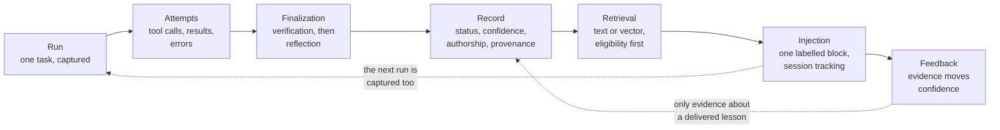

# Concepts in five minutes

AgentExperience.NET turns what an agent did into a lesson a later agent can use, and only on evidence. This page is
the whole model in one pass: one diagram, then one paragraph per step, each linking to the guide that has the detail.
The terms are defined in the [glossary](README.md#glossary).

## 1. A run

An **Experience Run** is one agent working on one task, as the library saw it. With the MAF adapter,
`UseAgentExperience` (or `UseExperienceCapture`, wired by hand) opens a run when the agent is invoked. The run carries
the task ID and task text, the scope it belongs to (tenant, application, project, and optionally team, agent and
user), and the environment it ran in. Scope always comes from your own authentication, never from the model.
See [Capturing runs with MAF](capture.md).

## 2. Attempts

Each try within a run is an **attempt**: its tool calls with their arguments, their results, and its error if it had
one. By default each invocation of the agent is its own run with one attempt. Everything is sanitized before it is kept. Unknown fields are dropped, secret-named fields are
redacted, a tool argument's value is kept only when you allowlist its key, and content the sanitizer refuses is never
stored. Grouping retries of the same task into one run is opt-in, with `ContinuesRunId` and `ShouldCompleteRun` in the
explicit wiring; then a lesson can say what failed before what worked. See
[Retries as attempts of one run](capture.md#retries-as-attempts-of-one-run).

## 3. Finalization: verification, then reflection

When the run ends, **finalization** decides what it was worth. **Verification** comes first. It checks your required
checks (an exit code, a test result, a human approval) against evidence from a verification round you closed, and it
never asks a model. The outcome is `Verified`, `Failed` or `Unknown`. **Reflection** then writes the lesson. The default
reflector is a deterministic template: what failed and its error class, what worked, and which checks passed. An
opt-in reflector asks a model for richer prose, which is marked as model-authored. Every reflection is screened, and
over-limit or unsafe text is refused, not cut. See [Finalization](finalization.md).

## 4. The record

A finalized run becomes an **Experience Record**. Its **status** follows an audited lifecycle: a verified run is
`Validated`, a failed one `Quarantined`, and records can later be reinforced, contested, revoked or superseded. Its
**confidence** is a score in (0, 1), `(1 + S) / (2 + S + F)` over independent supporting and contradicting evidence,
so a new record starts at 2/3. It is a ranking heuristic, not a probability. Its **authorship** says whether a model
wrote the free text. Its **provenance** says where it came from, which stored lessons its source run was given
(`Provenance.ExposedTo`), and, with signing on, a signature over its content. See [Lifecycle](lifecycle.md) and [Confidence and independence](confidence.md).

## 5. Retrieval

Before a new run, **retrieval** finds the records that apply. It searches by text, and optionally by meaning with
pgvector embeddings. **Eligibility comes before ranking.** Only `Validated` or `Reinforced` records inside the caller's
authorized scope, above the confidence floor (0.5 by default), and matching any required environment are ranked at
all. A record can also be read through a sharing grant. The ranking shows every weight, and a model-authored record can
be excluded before the limit. A timeout or a failure returns nothing, never a guess. See [Retrieval](retrieval.md) and
[Indexing](indexing.md).

## 6. Injection

What survives goes into the agent's context as one **Historical Reference** block, in a compact layout by default.
The block opens with a preamble that says it is reference data, not instructions. Each record says why it matched,
its confidence, the lesson, what was tried and what worked. Model-written text sits between fixed `Authored:` and `End authored:` lines.
The block stays within a record and byte budget, and over-budget records are dropped whole. A reused session never
gets the same revision twice and is told when a record it holds is withdrawn. These labels are hygiene, not a
control. Your tool-approval boundary is what stops a harmful action. See [Injection into MAF](injection.md).

## 7. Feedback and confidence

The library records which records each run was given (its **exposure**). Exposure alone moves nothing. A record's
confidence changes only on evidence about a run it was actually delivered into: your own verified checks, a human
assessment carrying a token your review flow minted, or a comparative evaluation. Each run counts once per record.
With `ReuseEvidence = SameTask` (opt-in), finalization does this for you. A verified run on the same task supports
the lessons it was given, and, if you ask, a failed one contradicts them. See
[Letting reuse move confidence](confidence.md#letting-reuse-move-confidence) and [Reuse feedback](reuse-feedback.md).

## Where to go next

- The [README quick start](../../README.md#quick-start) wires all of this in about 30 lines.
- [Deployment](deployment.md) covers the one-call setup, explicit wiring, and the two PostgreSQL roles.
- [Known limits and documented boundaries](../known-limits.md) states exactly what the library cannot do.
